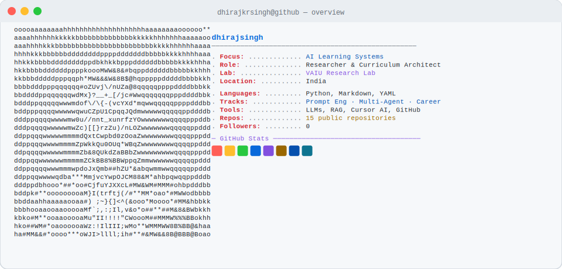

# Dhiraj Singh

<picture>
  <source media="(prefers-color-scheme: dark)" srcset="assets/hero-dark.svg">
  <source media="(prefers-color-scheme: light)" srcset="assets/hero-light.svg">
  
</picture>

I build AI systems, learning ecosystems, and reliability-first developer assets through [VAIU Research Lab](https://vaiu.ai/Research_Lab).

This profile is organized around one idea: **build AI capability through structured systems, real implementation, and evaluation-driven judgment instead of hype, random tutorials, or shallow demos.**

## Overview

I am building a public AI ecosystem that sits at the intersection of:

- multi-agent systems
- prompt and workflow engineering
- LLM evaluation and reliability
- AI career transition infrastructure

The goal is not to publish disconnected repositories.

The goal is to build a body of work that helps people learn, build, and apply AI with more rigor than the usual online noise.

## Why This Exists

Most AI profiles fall into one of two traps:

- scattered experiments with no clear system behind them
- generic educational content with no implementation depth

I am building in the gap between those two.

This GitHub is meant to function as:

1. a guided learning ecosystem
2. a public proof-of-work portfolio
3. a founder-style thesis around practical AI systems

<!--LATEST_SECTION_START-->
## Latest

Updated automatically on 27 Apr 2026 from the flagship repositories.

- **28 Mar 2026** — [ai-career-transition-roadmap](https://github.com/dhirajxai/ai-career-transition-roadmap) — Practical roadmap for switching into AI from software, data, product, QA, ops, design, or non-technical roles.
- **27 Mar 2026** — [agent-architecture-patterns](https://github.com/dhirajxai/agent-architecture-patterns) — Reactive, BDI, layered, and utility-based agent design patterns with runnable examples.
- **27 Mar 2026** — [cursor-ai-development-workflows](https://github.com/dhirajxai/cursor-ai-development-workflows) — Practical Cursor workflows for repo discovery, planning, implementation, debugging, testing, and review.

Current emphasis: applied showcase work, reliability-first workflows, and structured AI learning paths.
<!--LATEST_SECTION_END-->

## Start Here

Pick the route that matches your goal.

| Goal | Start With | Then Move To |
|------|------------|--------------|
| **Switch into AI from another role** | [ai-career-transition-roadmap](https://github.com/dhirajxai/ai-career-transition-roadmap) | Prompting, evals, applied AI projects |
| **Learn multi-agent systems** | [multi-agent-system-basics](https://github.com/dhirajxai/multi-agent-system-basics) | Architectures, coordination, planning, collaboration |
| **Learn prompt engineering properly** | [prompt-engineering-foundations](https://github.com/dhirajxai/prompt-engineering-foundations) | Cursor workflows, evals, anti-hallucination |
| **Build more reliable AI systems** | [llm-evals-and-anti-hallucination](https://github.com/dhirajxai/llm-evals-and-anti-hallucination) | Production workflows, review, iteration |

## Flagship Work

If you only open a few repositories, start here.

| Repository | Why It Matters |
|------------|----------------|
| [ai-career-transition-roadmap](https://github.com/dhirajxai/ai-career-transition-roadmap) | The strongest differentiator in the ecosystem, designed for people moving into AI with role clarity, proof-of-work strategy, and founder-style opportunity thinking |
| [multi-agent-system-basics](https://github.com/dhirajxai/multi-agent-system-basics) | The cleanest starting point for understanding how agent systems work from first principles |
| [prompt-engineering-foundations](https://github.com/dhirajxai/prompt-engineering-foundations) | Practical prompt design for developers who want repeatable and grounded outputs |
| [llm-evals-and-anti-hallucination](https://github.com/dhirajxai/llm-evals-and-anti-hallucination) | The reliability layer focused on evaluation, quality gates, and reducing unsupported model behavior |
| [cursor-ai-development-workflows](https://github.com/dhirajxai/cursor-ai-development-workflows) | Real development workflows for building faster with AI while preserving structure and review quality |

## Ecosystem Map

This profile is best understood as four connected tracks rather than a flat repo list.

### 1. Agent Systems

- [multi-agent-system-basics](https://github.com/dhirajxai/multi-agent-system-basics)
- [agent-communication-protocols](https://github.com/dhirajxai/agent-communication-protocols)
- [agent-architecture-patterns](https://github.com/dhirajxai/agent-architecture-patterns)
- [distributed-agent-coordination](https://github.com/dhirajxai/distributed-agent-coordination)
- [agent-based-simulation](https://github.com/dhirajxai/agent-based-simulation)

### 2. Prompting And Reliability

- [prompt-engineering-foundations](https://github.com/dhirajxai/prompt-engineering-foundations)
- [cursor-ai-development-workflows](https://github.com/dhirajxai/cursor-ai-development-workflows)
- [llm-evals-and-anti-hallucination](https://github.com/dhirajxai/llm-evals-and-anti-hallucination)

### 3. Career Transition

- [ai-career-transition-roadmap](https://github.com/dhirajxai/ai-career-transition-roadmap)

### 4. Public Builder Workflow

- a structured path from learning to implementation
- an emphasis on evaluation and system quality rather than demo-only output
- public artifacts that can serve as portfolio proof, creator leverage, or founder thesis material

## Founder Thesis

I am not trying to build a profile that only signals activity.

I am trying to build a profile that signals:

1. systems thinking
2. implementation discipline
3. evaluation literacy
4. educational product sense
5. long-term ecosystem design

That is why the repositories are sequenced, why evaluation shows up repeatedly, and why the strongest assets are built as reusable paths rather than isolated code dumps.

## Current Build Direction

Right now the emphasis is on turning the ecosystem into something more durable and more useful:

- stronger AI career transition assets
- more practical reliability and evaluation material
- clearer multi-agent learning paths
- better bridges from theory to applied showcase work

## Operating Principle

If you are using this work, the intended approach is simple:

1. Pick one goal only.
2. Start with the repo that matches that goal.
3. Build as you learn.
4. Use evaluation and proof of work as the standard, not passive reading.

## References And Inspiration

These public ecosystems influenced the way I think about structure, tooling, and open AI work:

## GitHub Snapshot

If you are learning from these repositories, start with the repo that matches your goal and move in sequence instead of jumping randomly.
